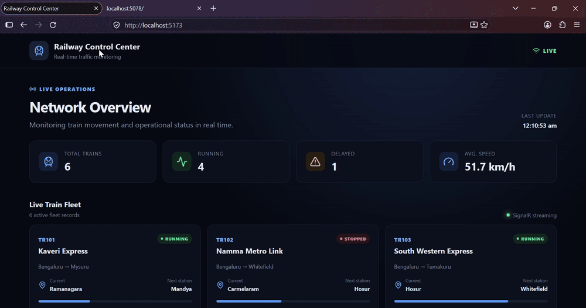

# Real-Time Railway Traffic Monitoring System

A portfolio project demonstrating real-time railway traffic monitoring with ASP.NET Core, SignalR and React.

## 🚀 Live Demo

🔗 **[Open Railway Control Center](https://real-time-railway-traffic-monitoring.vercel.app)**
https://real-time-railway-traffic-monitorin.vercel.app/

> Note: The live dashboard will display real-time train data once the ASP.NET Core backend is deployed.

## 🎥 Live Dashboard Demo



## Features

- Live train fleet dashboard
- ASP.NET Core REST API
- SignalR real-time updates
- Background train movement simulator
- Running / delayed / stopped states
- Speed, delay and route information
- Operational alerts
- Responsive control-center UI
- Automatic SignalR reconnection

## Tech Stack

- C# / .NET 10
- ASP.NET Core Web API
- SignalR
- React
- Vite
- Lucide React

## Run locally

### Backend

```bash
cd backend/RealTimeRailwayTrafficMonitoring.Api
dotnet restore
dotnet run
```

Backend:
- API: http://localhost:5078
- Swagger: http://localhost:5078/swagger
- SignalR: http://localhost:5078/hubs/train

### Frontend

Open a second terminal:

```bash
cd frontend
npm install
npm run dev
```

Open:
http://localhost:5173

The dashboard should show live train data and the values should change automatically every two seconds.

## Architecture

```text
Train Simulator (BackgroundService)
            |
            v
       TrainService
            |
            v
      SignalR TrainHub
            |
     real-time events
            |
            v
      React Dashboard

REST API --------------------> React Dashboard
GET /api/train
GET /api/train/{id}
```

## Resume description

**Real-Time Railway Traffic Monitoring System | C#, ASP.NET Core, SignalR, React**

Developed a real-time railway traffic monitoring dashboard using ASP.NET Core and SignalR to stream live train location, speed and operational-status updates to a React-based control-center interface. Implemented background train simulation, REST APIs, automatic SignalR reconnection and operational alerts.

## Important

This project is a simulation for portfolio purposes. It does not connect to real railway infrastructure.
